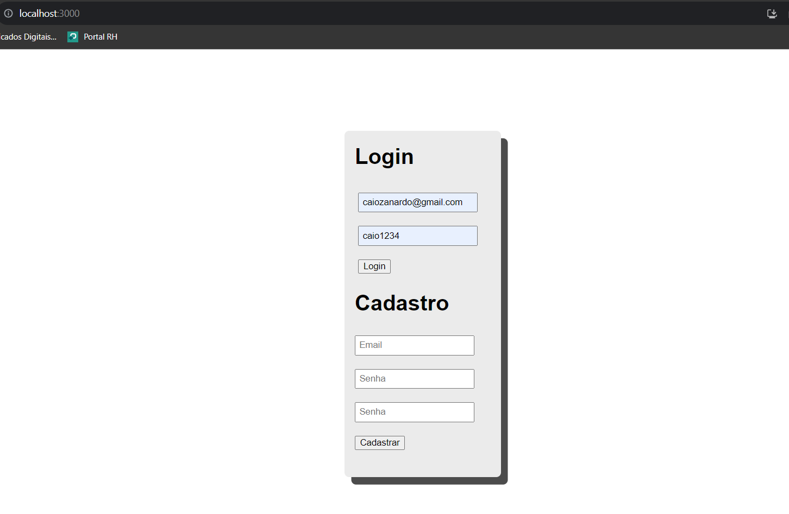
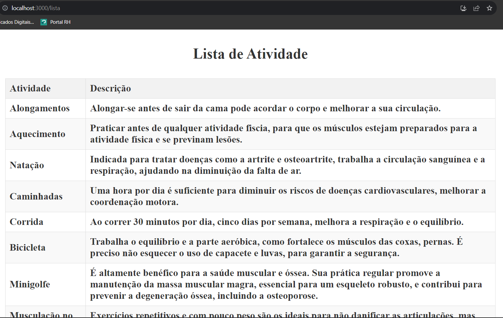

# Conteúdo criado para GlobalSolution OPTIMIZATION-TECHNOLOGY(FrontEnd) + + DIGITAL EXPERIENCE PLATAFORM(BackEnd)

### Link da API

https://github.com/CaioZanardo/GlobalSolution-Api-Devops

### Frontend

- Só baixar o front.zip;
- npm start na pasta "front" do conteudo;
- "http://localhost:3000" abrir a tela de cadastro/login;
  

- Após cadastrar e logar, exibirá um alert, clicar em "OK" e exibirá a lista de atividades fisica o usuario.
  

## Grupo

- André Spinelli Cintra RM 551016
- Augusto de Oliveira Laurino RM 93498
- Caio Felipe Britto Zanardo da Silva RM 95125
- Gabriel Wilke Azevedo RM 95211
- Guilherme de Lucas Garcia RM 94392
