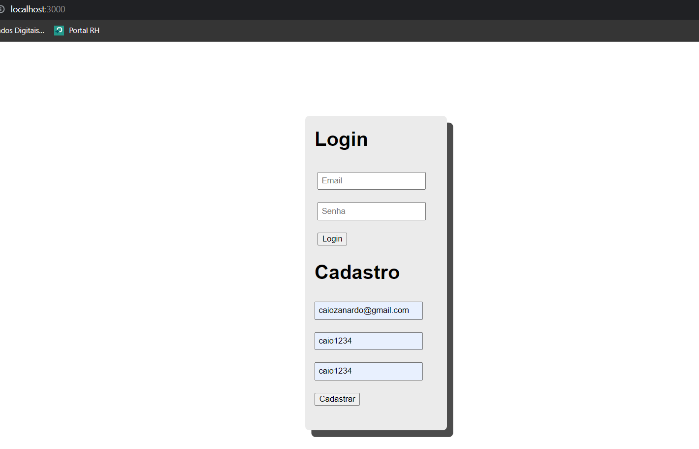
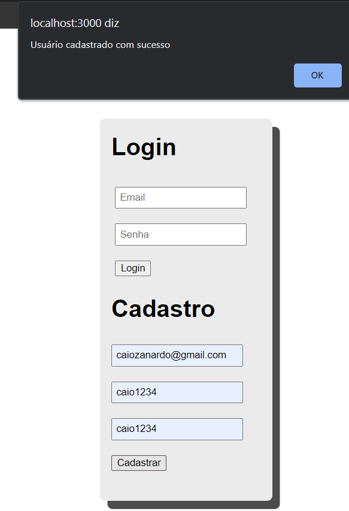
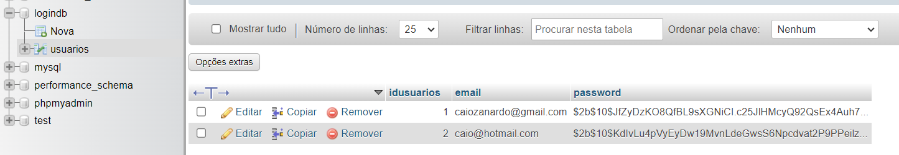
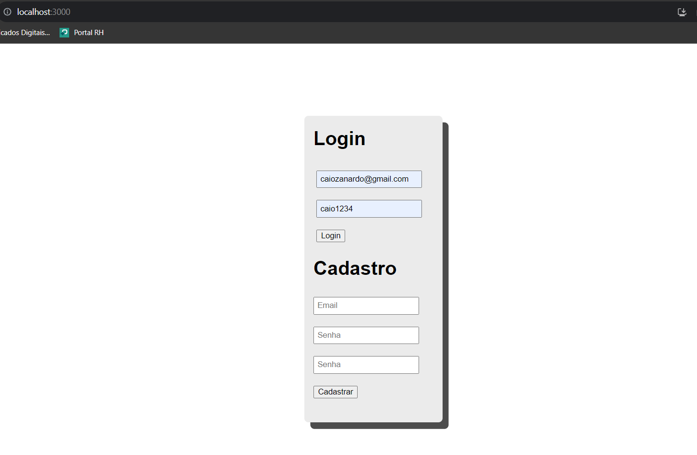
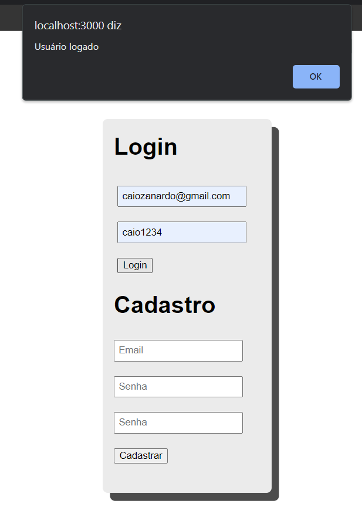
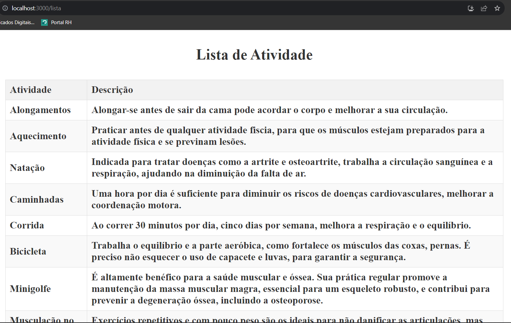

# Conteúdo criado para GlobalSolution OPTIMIZATION-TECHNOLOGY(FrontEnd) + DIGITAL EXPERIENCE PLATAFORM(BackEnd)

### Link da API

- https://github.com/CaioZanardo/GlobalSolution-Api-Devops

### Bibliotecas utilizadas no projeto

- formik;
- axios;
- yup;
- react-router-dom;

- #### Instalação: 
   - npm install formik axios yup react-router-dom

### Frontend

- No diretório front utilizar o "npm start" para iniciar a aplicação;
- Abrirá a tela de cadastro/login no path:
  - http://localhost:3000
- #### OBS: Para conseguir utilizar o backend as funções o BackEnd precisa estar "Running";

- Cadastrar;
  - Inserir dados correspondente;
  - Clicar em "Cadastrar"; 

- Cadastro realizado;
    - Clicar em "OK" para continuar;
  

- Após cadastro pode validar se realmente foi cadastrado no Banco de Dados;

- Realizar Login;
 

- Se estiver tudo OK com os dados após logar exibirá um alert;
  - Clicar em "OK" para continuar;

- Exibirá a lista de atividades fisica o usuario.

## Grupo

- André Spinelli Cintra RM 551016
- Augusto de Oliveira Laurino RM 93498
- Caio Felipe Britto Zanardo da Silva RM 95125
- Gabriel Wilke Azevedo RM 95211
- Guilherme de Lucas Garcia RM 94392
